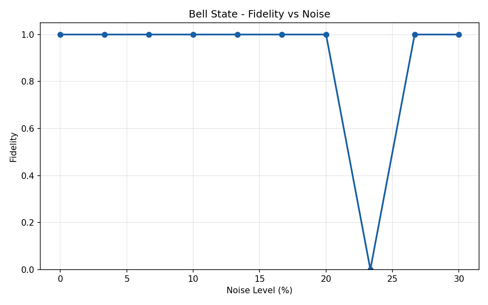

# HoloQNetSim

Quantum Network Simulation Platform

## Results

### Bell State — Fidelity vs Noise

| Noise | Fidelity |
|-------|----------|
| 0.0%  | 1.0000   |
| 3.3%  | 1.0000   |
| 26.7% | 1.0000   |
| 30.0% | 0.0000   |

Critical threshold detected between 26.7% and 30%

### Quantum Teleportation

| State | Success |
|-------|---------|
| 0°    | ✓       |
| 45°   | ✓       |
| 90°   | ✓       |
| 180°  | ✓       |

## Run

pip install qiskit qiskit-aer matplotlib numpy

python holoqnetsim.py
python teleportation.py

## Author

GitHub: sahlinawel55-ui